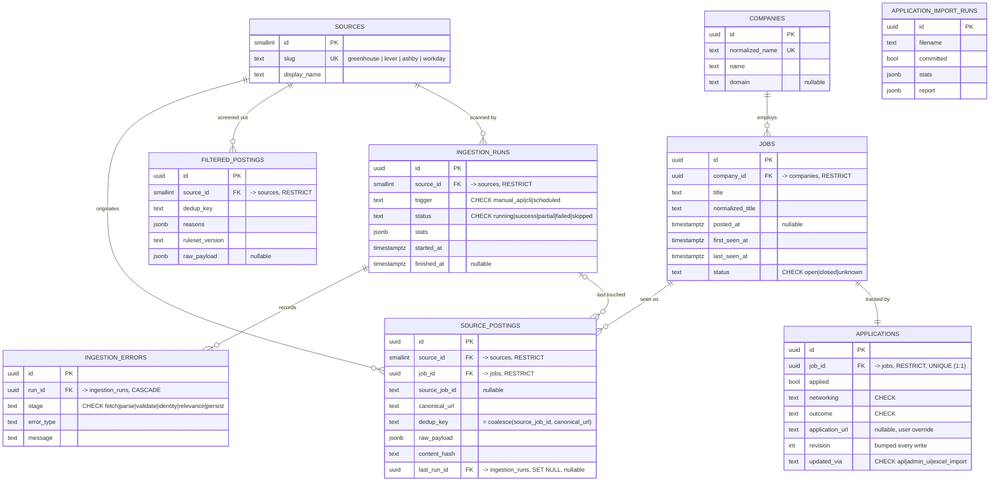

# Data model

The schema as of the day-3 initial migration (`migrations/versions/0001_initial_schema.py`).
The ORM models are in `app/models/`; the enums and their `CHECK` helper are in
`app/models/enums.py`. Constraint names follow the convention in `app/db/base.py`, so
`alembic check` (models == migration) and the schema tests can rely on them.

## Entities

## Load-bearing constraints

| Constraint | Table | Purpose |
|---|---|---|
| `uq_source_postings_source_id_dedup_key` | `source_postings` | ADR-0002 idempotency anchor |
| `uq_source_postings_source_job_id_partial` | `source_postings` | partial `UNIQUE (source_id, source_job_id) WHERE source_job_id IS NOT NULL` — backs up the anchor when the provider gives an id |
| `uq_filtered_postings_source_id_dedup_key` | `filtered_postings` | same dedup discipline for the reject ledger (ADR-0009) |
| `uq_applications_job_id` | `applications` | 1:1 with `jobs` |
| `fk_applications_job_id_jobs` (`ON DELETE RESTRICT`) | `applications` | ADR-0011 — a tracked job can't be deleted |
| `fk_ingestion_errors_run_id_ingestion_runs` (`ON DELETE CASCADE`) | `ingestion_errors` | the one intentional cascade |
| every `ck_*` | various | enum values enforced in the DB, sourced from `app/models/enums.py` |
| *(none)* | — | **zero triggers** — asserted by a schema test (ADR-0011) |

## Conventions

- **UUID primary keys**, generated app-side (`default=uuid.uuid4`) so ORM objects have an
  id before flush. `sources` is the exception: a small `SMALLINT` identity, since it is a
  fixed 4-row lookup seeded by `scripts/seed_sources.py`.
- **`created_at` / `updated_at`** via `CreatedAtMixin` / `TimestampMixin`;
  `server_default now()`, and `updated_at` bumped by SQLAlchemy `onupdate` (not a trigger).
- **Timestamps** are `TIMESTAMP WITH TIME ZONE`.
- The **full-text (GIN) index** for job search is deliberately *not* here — it serves the
  `/jobs?q=` endpoint and lands with search (day 8).
